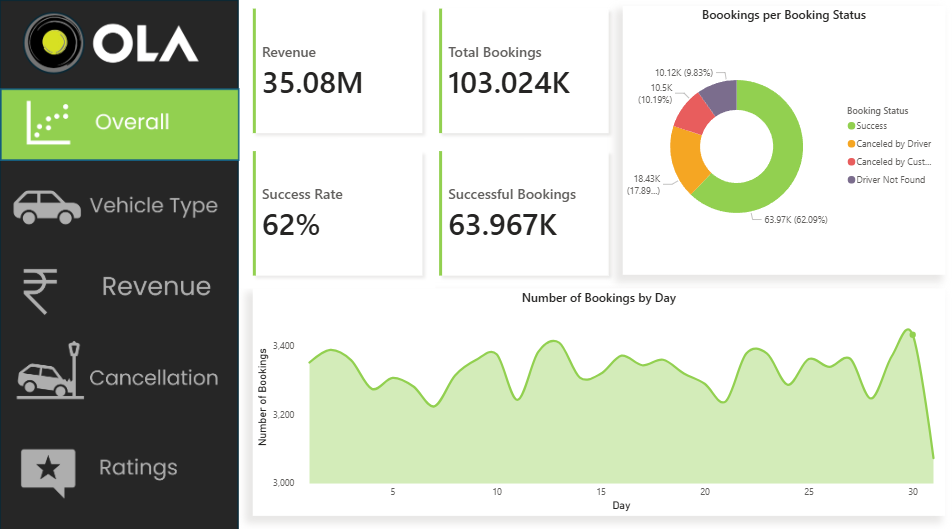
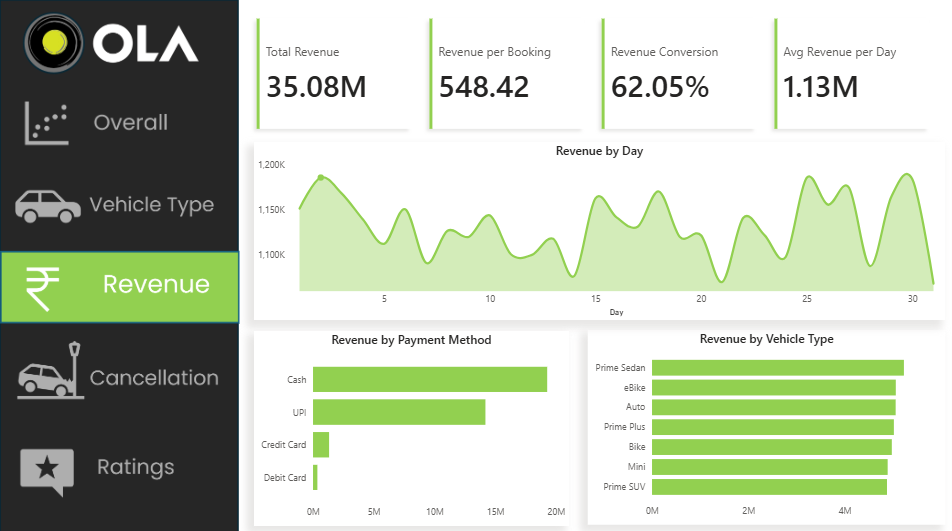
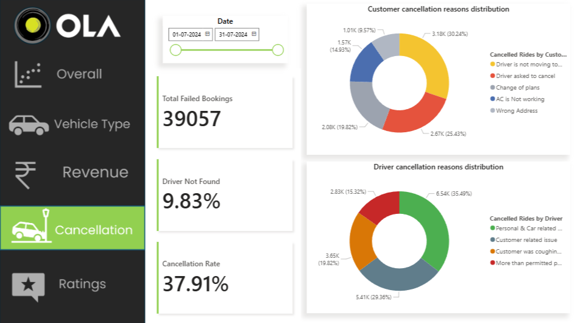
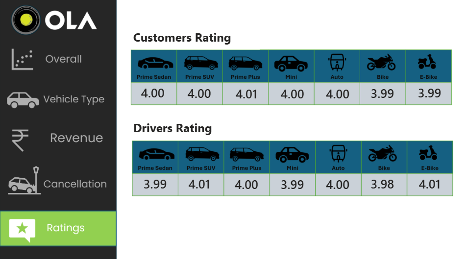

# 🚖 OLA Ride Analytics

---

## 📌 Problem Statement

Ola’s ride data includes successful bookings, cancellations, driver-not-found cases, and incomplete rides. A common pitfall is misinterpreting this data — overreporting revenue or combining success and failure records in KPI calculations.

This project answers key questions:

- ✅ What is the **true ride success rate** and **realized revenue**?
- 💳 Which **payment methods** contribute most to revenue?
- 🚗 Which **vehicle types** drive demand and earnings?
- ❌ Why are rides being cancelled (customer vs driver)?
- 🌟 How do **ratings** vary across vehicle types?
- 👥 Who are the **top customers** by value and demand?

> **Goal**: Build a clean, end-to-end analytics platform backed by:
> - A PostgreSQL database layer  
> - A reporting layer in Power BI  
> - An interactive Streamlit delivery interface

---

## 🧠 Approach: End-to-End Pipeline

> This is not a “dashboard-only” project. It is a full analytics system.

### 🔍 Stage A — Data Understanding

- `Booking_Status` identified as the core lifecycle indicator.
- `quoted_fare` exists for **all** bookings, but **only successful** rides generate `realized_revenue`.
- **Ratings** and **payment method** are only valid for successful rides (nulls are **logical**, not dirty).

### 🧹 Stage B — Data Cleaning & Feature Engineering (Python)

- Standardized all columns and data types.
- Created boolean flags:
  - `is_success`
  - `is_customer_cancel`
  - `is_driver_cancel`
  - `is_driver_not_found`
  - `is_failure`
  - `is_incomplete_ride`
- Preserved nulls where appropriate (e.g. no fake payment methods for failed bookings).

### 🗃 Stage C — Data Storage & Querying (PostgreSQL)

- Cleaned data stored in PostgreSQL table: `rides`
- Business questions solved directly in SQL
- Consistent logic powers both Power BI and Streamlit views

### 📊 Stage D — Reporting (Power BI Dashboard)

- Built a 5-page dashboard aligned to real business problems:
  - **Overall** – Snapshot of bookings and revenue  
  - **Vehicle Type** – Utilization and performance by segment  
  - **Revenue** – Payments, top customers, distance analysis  
  - **Cancellation** – Driver vs customer reasons  
  - **Ratings** – Quality by vehicle type

### 🖥 Stage E — Interactive Delivery (Streamlit)

- Connects directly to PostgreSQL (not Excel)
- Displays:
  - KPI summaries
  - SQL query outputs
  - Direct link to Power BI dashboard

---

## 📌 Data Facts (Reality Checks)

| Metric                      | Count     |
|----------------------------|-----------|
| Total Bookings             | 103,024   |
| Successful Rides           | 63,967    |
| Cancelled by Driver        | 18,434    |
| Cancelled by Customer      | 10,499    |
| Driver Not Found           | 10,124    |
| Total Failed Bookings      | 39,057    |

- ⚠️ **Important Nulls**: `payment_method`, `driver_rating`, `customer_rating`, etc. are intentionally null on failed rides. These are **not data issues**.

---

## 📐 Metrics Definitions

| Metric                     | Definition                                         |
|---------------------------|-----------------------------------------------------|
| Successful Booking         | `is_success = TRUE`                                |
| Revenue (Realized)         | `SUM(realized_revenue)` on **successful** rides   |
| Booking Value              | `SUM(quoted_fare)` on all rides (attempted value) |
| Cancellations              | Based on `is_customer_cancel`, `is_driver_cancel` |
| Driver Not Found           | `is_driver_not_found = TRUE` (supply failure)     |
| Ratings                    | Only valid for `is_success = TRUE`                |

---

## 🧠 SQL Business Logic (PostgreSQL)

Implemented directly in SQL (see [`sql/final_queries.sql`](sql/ola_insights.sql)):

- Successful bookings list  
- Average ride distance by vehicle type  
- Total customer cancellations  
- Top 5 customers by ride volume  
- Driver cancellations due to specific reasons  
- Max/Min driver ratings for Prime Sedan  
- Rides paid via UPI  
- Average customer rating per vehicle type  
- Total revenue from successful rides  
- Incomplete rides with reason fields  

---

## 📊 Power BI Dashboard

**Pages:**

1. **Overall** – Total bookings, success rate, and revenue snapshot  
2. **Vehicle Type** – Demand, average distance, and earnings per segment  
3. **Revenue** – Top customers, payment methods, ride distances  
4. **Cancellation** – Reasons split by customer vs driver  
5. **Ratings** – Quality assessment by vehicle type  

## Dashboard Screenshots

### Overview Dashboard


### Vehicle Type Analysis


### Revenue Analysis


### Cancellation Analysis


### Ratings Analysis



> 💡 **Embedding Note**: Power BI requires a Pro license to embed dashboards.  
> With a Free license, only a link is provided.

🔗 **Power BI Report Link**: *(replace with your actual dashboard URL)*

---

## 🌐 Streamlit App

🧪 **Live Demo**: [https://ola-analytics-demo.streamlit.app](https://ola-analytics-demo.streamlit.app) *(replace if needed)*

### Features:

- Connects to PostgreSQL database  
- Shows dynamic KPI summaries  
- Displays outputs from SQL business logic  
- Links to the Power BI dashboard  

> ❗ With Power BI Free, iframe embedding may not render – so dashboard is linked directly.

---

## 🚀 How to Run the App (Local Machine)

### 1️⃣ Clone the Repository

```bash
git clone <your-repo-url>
cd OLA_PROJECT
```

### 2️⃣ Set Up Virtual Environment

```bash
python -m venv venv

# Windows
venv\Scripts\activate

# macOS/Linux
source venv/bin/activate
```

### 3️⃣ Install Requirements
```bash
pip install -r requirements.txt
```
### 4️⃣ Configure PostgreSQL

- Ensure PostgreSQL is running  
- **Database**: `ola_analytics`  
- **Table**: `rides`  
- Update database credentials in: `app/db.py`

### 5️⃣ Run Streamlit
```bash
streamlit run app/app.py
```
## 💡 Key Insights

### 🚫 High Failure Rate
- → 39,057 out of 103,024 bookings fail (≈ 38%)
- → This materially affects success KPIs.

### 💰 Revenue Inflation Trap
- → `quoted_fare` exists even for failed bookings
- → Use `realized_revenue` on successful rides only

### ❌ Failure ≠ Cancellation
Failures are categorized as:
- **Customer cancellations**: 10,499  
- **Driver cancellations**: 18,434  
- **Driver not found**: 10,124 (pure supply shortage)  
- → Lumping all failures together hinders diagnosis

### 🌟 Ratings Are Conditional
- → Present only for successful rides
- → Dashboards must filter accordingly

### 💳 Payment Method Logic
- → Only valid for successful bookings
- → Analyze filtered data to avoid blanks

---

## 🛠 Tech Stack

- **Python**: `pandas`, `SQLAlchemy`
- **SQL**: PostgreSQL
- **Data Storage**: PostgreSQL (`ola_analytics.rides`)
- **Visualization**: Power BI
- **App Delivery**: Streamlit

---

## 📦 Deliverables

| Component            | Location                     |
|---------------------|------------------------------|
| Clean Database       | PostgreSQL (`rides` table)   |
| SQL Queries          | `ola_insights.sql`      |
| Power BI Dashboard   | 5 structured report pages    |
| Streamlit App        | `app/app.py`, `app/db.py`    |
| Documentation        | `README.md`, metrics docs    |

---

## 👥 Contributors

- **Pudi Manikanta** – Data Analyst / AI/ML Engineer

